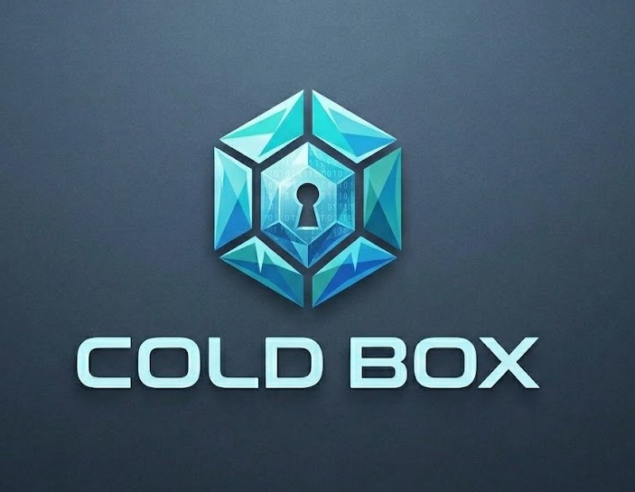
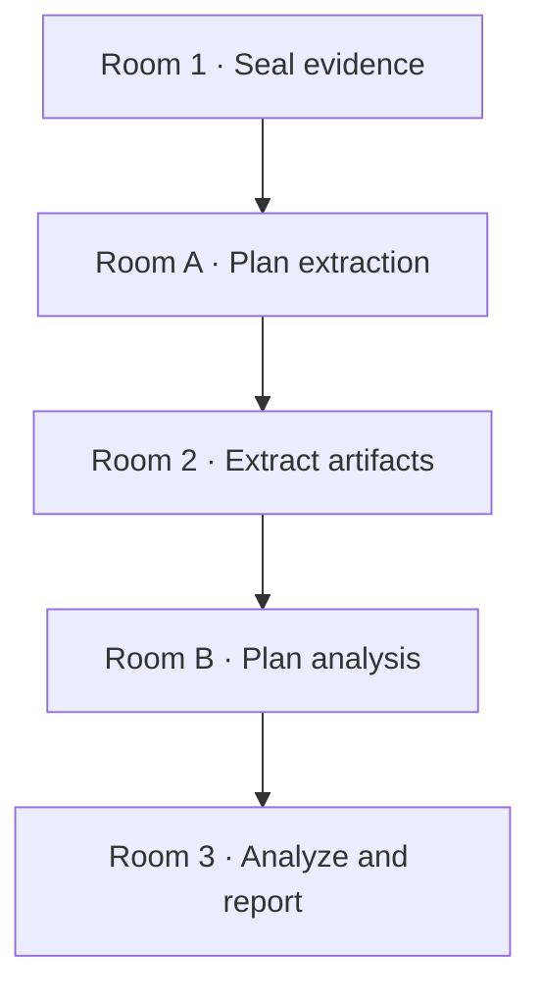
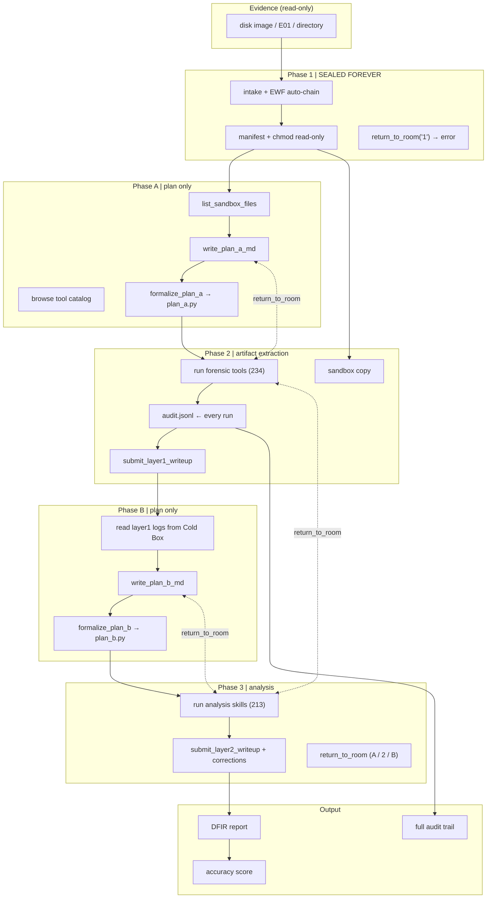
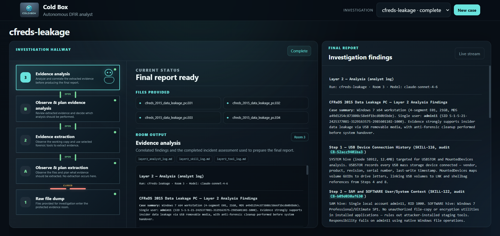
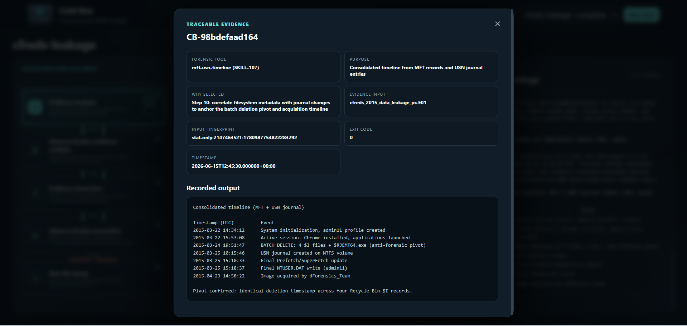

<p align="center">
  
</p>

<h1 align="center">Cold Box</h1>

<p align="center">
  <strong>Autonomous agentic digital forensics and incident reporting.</strong><br>
  Cold Box investigates compromised systems end-to-end and delivers a complete, evidence-backed report without any human in the loop.
</p>

<p align="center">
  <a href="./LICENSE">MIT License</a>
</p>

---

## Why Cold Box

Digital forensics and incident response require sustained expert effort: manual tool execution, artifact correlation, and report writing over hours or days. The work is repetitive, exhausting, and high stakes. Accuracy at every step is not optional.

**Typical AI assistants make this worse, not better.** Models with open-ended access can assert findings without proof, mix inference with fact, and provide no chain of custody. In serious IR work, that is not usable. Stakeholders need to know how each conclusion was reached. An answer without an audit trail cannot be trusted.

**Rule-based automation is not enough either.** Fixed rule trees assume familiar attack patterns. Real incidents do not. An approach that only handles known scenarios fails when an adversary takes an unexpected path.

**Cold Box closes that gap.** It runs full investigations on compromised systems without human intervention. Each step is reasoned, logged, and tied to evidence. The output is a detailed incident report where every finding cites the action and artifact that supports it. The full reasoning remains available for audit. The investigation is complete, reliable, and grounded in proof.

---

## How it works

Cold Box runs each case through an **investigation hallway**: five gated stages in a fixed order. Cold Box cannot skip ahead or act outside the current stage. Each gate protects evidence, forces deliberate planning, and requires proof before the case advances.

The system ships **234 forensic extraction tools** and **213 analysis skills**. The agent selects from this catalog at runtime under harness control.



The diagram below shows the full pipeline: evidence intake, gated phases, audit logging, self-correction loops, and final output.



### Room 1 · Seal evidence

Evidence enters once: disk images, files, or other artifacts supplied for the case. Cold Box records what was received, locks the original material read-only, and creates a working copy for investigation. The sealed source is never modified again. Chain of custody starts here.

### Room A · Plan extraction

Cold Box reviews the working copy and decides what to pull out next: registry hives, event logs, filesystem listings, browser history, and other artifacts relevant to the incident. No extraction runs in this stage. Planning comes first so the investigation is intentional, not a random sequence of tool calls.

### Room 2 · Extract artifacts

Cold Box executes the extraction plan against the working copy using **234 forensic extraction tools** covering filesystem, registry, logs, memory artifacts, and related sources. Every action is logged with a unique proof identifier, command output, and timestamps. Findings must cite that proof before a plan step can pass. If extraction is incomplete, the stage does not close.

### Room B · Plan analysis

Cold Box reads what was actually extracted, not what was expected. It then plans how to interpret and connect those artifacts: timelines, user activity, persistence mechanisms, data movement, and related analysis tasks. No analysis runs until the plan is written and validated.

### Room 3 · Analyze and report

Cold Box executes the analysis plan across **213 analysis skills**, correlates artifacts, and resolves open questions. If analysis reveals a gap in extraction, the case returns to Room 2, completes the missing work, and continues with corrections on record. When analysis is complete, Cold Box produces the final evidence-backed incident report.

Each stage enforces **when** Cold Box may act and **how** it must prove its work. **What** to investigate within those boundaries is decided by the agent at runtime. That separation keeps the run fully autonomous without sacrificing rigor.

---

## Demo

▶️ **[Watch the demo](https://vimeo.com/1203757809)** — Cold Box investigating a disk image end-to-end in the live dashboard: sealing evidence, walking the five rooms, and producing a proof-linked final report.

---

## Screenshots

Investigation hallway and live case progress:



Every report finding links to proof. Click an evidence reference to open the matching audit record and tool output:



---

## Results

Cold Box has completed full autonomous investigations on real forensic disk images with no human in the loop. Every finding in the reports below traces to a logged action in `audit.jsonl`.

| Case | Benchmark | Accuracy |
|------|-----------|----------|
| Terry work USB holdout | `terry_usb` | **100%** (4/4 required · 2/2 optional) |
| NIST CFReDS Data Leakage PC | `ndlc_leakage_pc` | **100%** (4/4 required · 1/1 optional) |
| Automated test suite | harness + guards + executor | **188/188 tests pass** |

### Terry work USB holdout

| Metric | Result |
|--------|--------|
| Required recall | **100%** (4/4) |
| Optional recall | **100%** (2/2) |
| Precision | **100%** |
| F1 | **1.0** |
| Layer 1 / 2 self-score | 9 / 9 |

Key findings: EWF disk image verified, FAT32 filesystem, volume label **TERRYS WORK**, the suspect executable **R54402.EXE** and automated browsing scripts (**webauto.py / patentauto.py**) identified, partition layout and image integrity confirmed.

### NIST CFReDS Data Leakage PC

| Metric | Result |
|--------|--------|
| Required recall | **100%** (4/4) |
| Optional recall | **100%** (1/1 in scope) |
| Precision | **100%** |
| F1 | **1.0** |
| Layer 1 / 2 self-score | 9 / 9 |

Key findings: Windows 7 host, suspect user **admin11**, USB device connection, batch file deletion at identical timestamps (anti-forensic cleanup), full artifact chain from USB history through shellbags, jump lists, event logs, and filesystem metadata. Web exfiltration ruled out from browser history.

Sample run artifacts: [`docs/runs/cfreds-leakage/`](docs/runs/cfreds-leakage/). Reproduce a score:

```bash
cd cold-box-room
python scripts/score_e2e_accuracy.py --case-id CASE_ID --benchmark BENCHMARK_ID
```

Full methodology: [`docs/ACCURACY.md`](docs/ACCURACY.md).

---

## Run Cold Box

### Prerequisites

- **Python 3.10+**
- **Linux** (Ubuntu 22.04+ recommended) with standard forensic CLI tools on `PATH`
- **Claude Code** (the default), or an **Anthropic API key** to run the native Python agent instead
- **Evidence** locally (disk image, E01/EWF chain, or directory). Images are not bundled in this repository.

### Install

```bash
git clone https://github.com/at-src/cold-box.git
cd cold-box
python3 -m venv .venv
source .venv/bin/activate          # Windows: .venv\Scripts\activate
pip install -e "cold-box-room/[dev,mcp]"
```

### Authentication

Cold Box runs through **Claude Code** — point it at this project and run. Alternatively, set an **Anthropic API key** to run the native Python (terminal) agent only:

```bash
export ANTHROPIC_API_KEY=sk-ant-...        # or add it to cold-box/.env
```

For large disk images, also set `export COLD_BOX_R1_STAT_ONLY=1`.

### Verify the harness (no API key)

```bash
cd cold-box-room
pytest tests/ -q
```

Runs **188 tests** against the hallway, seal logic, executor security, and accuracy scoring. No API spend.

### Run an investigation

**Point Cold Box at your evidence and run one command.** Evidence can be a **single disk image**, an **EWF/E01 chain** (E02–E04 auto-attach from the same folder), or a **directory** of files.

#### Claude Code — fully autonomous, with the live dashboard

```bash
cd cold-box/cold-box-room
source ../.venv/bin/activate

cold-box-room-hallway-cc \
  --case-id my-case \
  --evidence /path/to/YOUR-evidence.E01 \
  --ui
```

| Flag | What to put there |
|------|-------------------|
| `--case-id` | Any name you choose — it's the case title shown in the dashboard. |
| `--evidence` | The path to **your** disk image, E01 chain, or folder. |
| `--ui` | Starts the live dashboard at `http://127.0.0.1:8765` so you watch the agent walk the five rooms in real time. Use `--no-open` on a headless server. |

Cold Box seals the evidence read-only, then drives Claude Code through the full hallway (Room 1 → A → 2 → B → 3) and writes the final report — no further input. The case stays in the dashboard afterward with every finding linked to its proof.

On a remote VM, forward the dashboard port from your laptop first:

```bash
ssh -L 8765:localhost:8765 user@<vm-ip>
# then open http://localhost:8765/?case=my-case
```

#### Interactive Claude Code (drive the MCP tools yourself)

```bash
cd cold-box/cold-box-room
cold-box-room intake   --case-id my-case --source /path/to/YOUR-evidence.E01
cold-box-room r1-check --case-id my-case --promote
claude     # then: "investigate case my-case using the cold-box-room MCP tools"
```

#### Native Python agent (no Claude Code; uses `ANTHROPIC_API_KEY` directly)

```bash
cold-box-room-hallway --run-id my-case --case-id my-case \
  --evidence /path/to/YOUR-evidence.E01 --ui
```

Add `--benchmark terry_usb` (or another benchmark id) to score the run against a known answer key when it completes.

One-time Claude Code setup (optional): `cold-box-room/scripts/setup_claude_code.sh`

### Investigation dashboard

The web dashboard shows room-by-room progress, live audit events, plan steps, and the final report with clickable evidence links.

**Standalone — browse any completed or in-progress case:**

```bash
cold-box-room-ui                 # serves the dashboard on http://127.0.0.1:8765
```

Open the URL and pick any case from the **dropdown** (top right) to view its rooms, live stream, and final report — completed runs stay browsable indefinitely.

**Running on a remote Linux VM?** The dashboard binds to the VM's `localhost`, so tunnel it to your laptop over SSH — no extra inbound ports needed:

```bash
# 1) on the VM: start the dashboard
cold-box-room-ui
# 2) on YOUR machine (new terminal): forward the port through SSH
ssh -L 8765:localhost:8765 user@<vm-ip>
# 3) on YOUR machine: open the browser
#    http://localhost:8765/?case=<case-id>
```

**Embedded in a native hallway run (recommended):**

Add `--ui` to any `cold-box-room-hallway` command and the dashboard starts automatically alongside the investigation:

```bash
cold-box-room-hallway \
  --run-id my-case \
  --case-id my-case \
  --evidence /path/to/evidence.E01 \
  --ui
# Dashboard: http://127.0.0.1:8765/?case=my-case
```

Use `--no-open` to suppress the automatic browser launch (useful on headless servers), and `--ui-host 0.0.0.0` to expose the dashboard on all interfaces.

**Launch an investigation from the dashboard:**

Open the dashboard, fill in the case ID and evidence path, and click **Start investigation**. The run executes in the background. Full stdout and stderr are written to `records/<case-id>/hallway_run.log` — open it from the artifact list in the UI or read it directly if anything goes wrong.

> The dashboard requires `ANTHROPIC_API_KEY` to be set before starting (or present in a `.env` file at the repository root).

### Environment variables

| Variable | Purpose | Default |
|----------|---------|---------|
| `ANTHROPIC_API_KEY` | Anthropic API access | native agent / dashboard only |
| `COLD_BOX_R1_STAGING` | Sealed evidence root | `./r1-staging` |
| `COLD_BOX_R2_SANDBOX` | Working copy for tools | `./r2-sandbox` |
| `COLD_BOX_ROOM_RECORDS` | Plans, logs, audit trail | `./records` |
| `COLD_BOX_R1_STAT_ONLY` | Skip full hash on large images | unset |
| `COLD_BOX_DOTENV` | Path to `.env` file | repo root `.env` |

### After a run

Case output lives under `records/<case-id>/`: plans, investigation logs, `audit.jsonl`, Layer 1 and Layer 2 reports.

```bash
cd cold-box-room
python scripts/bundle_case.py --case-id my-case
```

Generates a portable bundle under `records/my-case/bundle/` including the final report with proof links.

---

## Future direction

Cold Box today delivers full digital forensics on compromised systems end to end: sealed evidence, gated investigation, and proof-linked reporting on disk images and host artifacts.

The next phase extends that same autonomous model beyond offline system analysis. Cold Box will investigate web-facing assets directly over the network, applying the same forensic discipline to sites and services that it applies to full system images today.

Beyond detection and analysis, the roadmap includes live incident response: guided containment, mitigation steps, and coordinated action on active systems while preserving evidence and auditability throughout the response.
