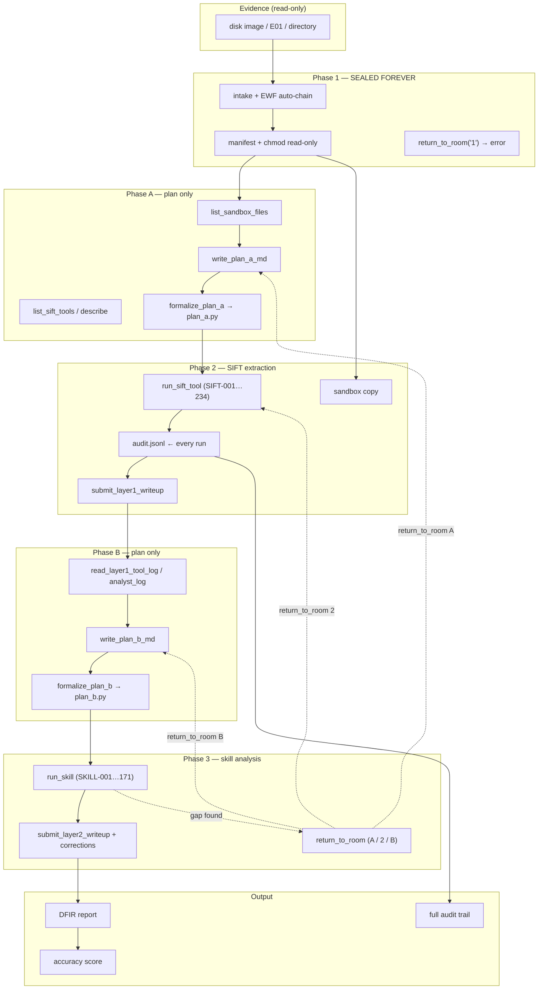

# Cold-box — Autonomous DFIR Analyst on the SIFT Workstation

> *The evidence is sealed. The plan is written. Every tool run is on the record. The analyst investigates — the harness enforces discipline.*

**Submission:** [SANS FIND EVIL! Hackathon 2026](https://findevil.devpost.com/)  
**Repository:** [github.com/at-src/cold-box](https://github.com/at-src/cold-box)  
**License:** [MIT](./LICENSE)  
**Architecture:** Custom MCP Server + Claude Code as the agentic framework

---

## Results

Autonomous full-hallway runs on real forensic images, zero human intervention, `claude-sonnet-4-6`:

| Case | Benchmark | Accuracy | Wall time | Agent turns |
|------|-----------|----------|-----------|-------------|
| Terry work USB holdout | `terry_usb` | **100%** (4/4 req · 2/2 opt) | ~16 min | 89 |
| NIST CFReDS Data Leakage PC | `ndlc_leakage_pc` | **100%** (4/4 req · 1/1 opt) | ~27 min | — |
| Unit + integration suite | harness + guards + executor | **183/183 tests pass** | seconds | — |

Every finding in both reports traces back to a specific `audit_id` row in `audit.jsonl`. Reproduce any score with `scripts/score_e2e_accuracy.py`.

---

## Table of contents

- [The design philosophy](#the-design-philosophy)
- [How the investigation pipeline works](#how-the-investigation-pipeline-works)
- [Architecture and trust boundaries](#architecture-and-trust-boundaries)
- [Self-correction](#self-correction)
- [Quick start](#quick-start)
- [Submission components 1–8](#submission-components-18)
- [What comes next](#what-comes-next)

---

## The design philosophy

Most agentic DFIR prototypes fail in one of two ways.

The first way: **too much freedom.** A raw LLM with `execute_shell_cmd` will run any command, hallucinate findings it can't verify, modify evidence by accident, and produce reports with no traceable chain. When it gets something wrong, there is no audit trail to understand why.

The second way: **too little freedom.** Rule engines and playbook YAML solve hallucination by hardcoding analyst knowledge as decision trees. When path-based extraction fails, the rule fires the inode fallback. When the playbook encounters a case class it hasn't seen before, it fails — not because the AI can't reason about it, but because the YAML never covered it. The analyst is trapped in a box of pre-written rules, not investigating.

**Cold-box takes a different position:** a senior analyst doesn't need a flowchart. They need sealed evidence, a structured methodology, and an audit trail. Give them those three things and let them investigate.

The investigation phases are chain-of-custody protocol, not an if-else tree.

- They enforce **when** the analyst can act: no extraction before a written plan, no analysis before extraction is scored.
- They enforce **how** the analyst proves its work: no step passes without an `audit_id`, no writeup submits with unresolved holds.
- They leave **what** to investigate entirely to Claude — which SIFT tools to run, what the evidence means, which hypotheses to form, how to self-correct when a path fails.

The result is an analyst that behaves with the discipline of a senior examiner — not because we enumerated every decision it should make, but because the environment it operates in demands rigour at every step.

---

## How the investigation pipeline works

```
Phase 1 (seal) → Phase A (plan) → Phase 2 (extract) → Phase B (plan) → Phase 3 (analyse) → complete
```

Each phase exposes a different set of MCP tools. The harness enforces the boundary in code — calling the wrong tool in the wrong phase raises an error before execution. Promotion to the next phase requires passing a harness checkpoint, not just a model promise.

### Phase 1 — evidence sealing

Evidence is staged once and sealed. The original file gets read-only permissions and a manifest. No agent ever operates in Phase 1 after sealing. The door locks permanently — `return_to_room` rejects `"1"` in code, not in a prompt.

What this buys: even if the model is compromised, jailbroken, or just wrong, it cannot touch the original evidence. Phase 2 operates on a copy.

### Phase A — extraction planning

The analyst arrives with the sandbox copy visible (`list_sandbox_files`) and the full SIFT tool catalog browsable (`list_sift_tools`, `describe_sift_tool`). It cannot run tools yet. It writes `plan_a.md` — a numbered list of what to extract and why — which the harness formalizes into `plan_a.py` with typed checkpoints. Once `plan_a.py` exists and passes validation, Phase 2 opens.

This separation matters. An analyst forced to write a plan before extracting actually thinks about what it's looking for. One handed a shell prompt immediately starts running commands.

### Phase 2 — SIFT extraction

The analyst runs its plan step by step using `run_sift_tool(tool_id="SIFT-###")`. Catalog: 234 tools covering image metadata, partition geometry, filesystem enumeration, registry extraction, event logs, browser artifacts, USN journal, prefetch, shellbags, recycle bin — the full SIFT toolkit.

Every `run_sift_tool` call returns an `audit_id`. Each plan step must cite one before it can pass. The harness writes the tool log; the analyst writes findings. They cannot be confused.

At the end of Phase 2 the analyst submits a Layer 1 writeup — findings, reasoning, and a self-score. If self-score < 9 or plan score < 70% or any step is unresolved, the harness blocks the submit. The analyst must fix and retry.

Step statuses: `passed` (evidence found, `audit_id` attached) · `fail` (ran the tool, evidence not there) · `not_relevant` (dropped from scoring pool) · `held_for_later` (blocks submit until resolved).

When Phase 2 passes, `submit_layer1_writeup` automatically promotes to Phase B.

### Phase B — analysis planning

Same structure as Phase A, but now the analyst reads what was actually extracted (`read_layer1_tool_log`, `read_layer1_analyst_log`) and plans what to analyse. It can also browse the 171 runnable skills (`list_skills`, `describe_skill`). Writes `plan_b.md` → harness formalizes → `plan_b.py` → Phase 3 opens.

### Phase 3 — skill analysis

The analyst runs skills via `run_skill(skill_id="SKILL-###")` — pre-built analysis playbooks for USB device correlation, shellbag analysis, SAM/hive parsing, event log session timelines, recycle bin $I metadata, jump list artifact reconstruction, prefetch execution history, MFT+USN timeline consolidation, and more.

If analysis reveals a gap in extraction — a missing artifact, an unexplored artifact class — the analyst calls `return_to_room(2)`, runs the missing SIFT tool, and returns to Phase 3. Phases A and B stay open through the full investigation. Any revisit forces the analyst to document corrections in the Layer 2 writeup; the harness blocks submission if corrections are empty after a revisit.

Once all plan steps are resolved, score ≥ 70%, and self-score ≥ 9, `submit_layer2_writeup` produces the final DFIR report and marks the case complete.

---

## Architecture and trust boundaries

**Pattern:** Custom MCP Server + Claude Code as the execution engine.

The MCP server exposes structured tool functions — not `execute_shell_cmd`. Claude cannot run arbitrary commands because arbitrary commands do not exist on the wire.

### Full system diagram



### Architectural guardrails — enforced in code

| Boundary | What it prevents | Where |
|----------|-----------------|-------|
| Phase gate (`require_room`) | Wrong-phase tools raise before execution | `r1/hallway.py` |
| Per-phase allowlist | `run_sift_tool` blocked in Phases A/B | `planning/guard.py` |
| Phase 1 seal | Write to staged evidence → `TouchForbiddenError` | `r1/seal.py` |
| Phase 1 lock | `return_to_room("1")` → error | `r1/hallway.py` |
| Catalog-only execution | No free shell; only `SIFT-###` / `SKILL-###` IDs | `r2/executor.py` |
| Sandbox input scope | Tool inputs must be under `sandbox/{case_id}/` | `r2/sandbox_input.py` |
| Scratch-only output | Path rewrite blocks writes outside scratch | `r2/security.py` |
| Harness logbooks | Analyst cannot append to tool/skill logs | `r2/tool_log.py` |
| Plan proof gate | `passed` requires `audit_id` or `run_id` | `planning/plan_py.py` |
| Submit gate | Held steps, low score, or missing self-score block submit | `planning/scoring.py` |

### Prompt-based guardrails — quality layer on top

System prompts and MCP instructions reinforce: cite `audit_id` in findings, plan before extracting, document corrections after any revisit. These sharpen analytical quality. The architectural walls above already prevent the failure modes that matter — wrong-phase execution, evidence tampering, untraceable findings. The prompts are not the safety system; the code is.

If you bypass all the prompts and the model ignores every instruction, it still cannot: touch the original evidence, run a destructive command, skip writing a plan and jump straight to extraction, or pass a plan step without proof. Those are hard errors.

---

## Self-correction

Cold-box supports two forms of self-correction, both on the record.

**In-turn correction (most common):** When a tool call fails — path not found, wrong inode, unexpected output format — the analyst pivots immediately. In the CFReDS run, path-based extraction failed for registry hives; the analyst switched to `ifind` → inode lookup → `icat` by inode without any instruction to do so. This is real-time reasoning about failure, not a fallback rule.

**Cross-phase correction:** When Phase 3 analysis reveals a gap in the Phase 2 extractions — a missing artifact class, an unexplored timeline window — the analyst calls `return_to_room(2)`, runs the missing SIFT tool, and returns to Phase 3. The harness then requires a `corrections` field in the Layer 2 writeup documenting what was wrong, what was fixed, and why. This is enforced: submitting with a revisit and no corrections raises a checkpoint error.

Both forms produce an auditable record. You can trace exactly when the analyst changed course, what triggered it, and what the outcome was.

---

## Quick start

**Harness proof (no API key, 2 min):**

```bash
git clone https://github.com/at-src/cold-box.git
cd cold-box/cold-box-room
python3 -m venv .venv && source .venv/bin/activate
pip install -e ".[dev]"
pytest tests/ -q
# 183 tests, no spend
```

**Full autonomous run (API key + SIFT VM + evidence):**

```bash
export ANTHROPIC_API_KEY=sk-ant-...
export COLD_BOX_R1_STAT_ONLY=1      # skip MD5 on large E01s

# Claude Code track (recommended — Claude is the analyst)
pip install -e ".[dev,mcp]"
cold-box-room-hallway-cc \
  --case-id terry-demo \
  --evidence /evidence/unseen-terry-usb/terry-work-usb-2009-12-11.E01

# Native Python track (same harness, Python agent loop)
cold-box-room-hallway \
  --run-id terry-demo \
  --evidence /evidence/unseen-terry-usb/terry-work-usb-2009-12-11.E01 \
  --benchmark terry_usb
```

Pass a **directory**, a single **E01**, or an **EWF chain** — E02–E04 segments auto-attach from the same folder.

**Environment variables:**

| Variable | Purpose | Default |
|----------|---------|---------|
| `COLD_BOX_R1_STAGING` | Sealed evidence root | `./r1-staging` |
| `COLD_BOX_R2_SANDBOX` | Working copy for tools | `./r2-sandbox` |
| `COLD_BOX_ROOM_RECORDS` | Plans, logs, audit trail | `./records` |
| `COLD_BOX_R1_STAT_ONLY` | Skip full hash on large images | unset |
| `ANTHROPIC_PROMPT_CACHE` | Enable prompt caching | unset |

---

## Submission components 1–8

### 1 — Code repository

| Item | Detail |
|------|--------|
| URL | https://github.com/at-src/cold-box |
| License | MIT — [`LICENSE`](./LICENSE) |
| Install | `pip install -e ".[dev,mcp]"` from `cold-box-room/` |
| Entry points | `cold-box-room-hallway-cc` · `cold-box-room-hallway` · `cold-box-room-mcp` |
| Tests | `pytest tests/` — 183 cases covering hallway flow, Phase 1 seal, executor security, plan locking, evidence intake, accuracy scoring |

### 2 — Demo video

≤ 5 minutes · live terminal · audio narration · real forensic image · self-correction visible.

**Video URL:** *(add after recording)*

### 3 — Architecture diagram

Full diagram in [§ Architecture and trust boundaries](#architecture-and-trust-boundaries) above.

Key distinction: prompt-based guardrails (quality layer) vs. architectural guardrails (hard errors). Both are documented in the diagram and the guardrails table.

### 4 — Written project description

**What it does**

Cold-box is an autonomous DFIR analyst for the SANS SIFT Workstation. It works through five investigation phases — seal evidence, plan extraction, run 234 SIFT tools, plan analysis, run 171 skills — producing Layer 1 and Layer 2 reports where every finding traces back to the exact tool execution that produced it via `audit_id`.

**How we built it**

Finite-state pipeline with harness-gated phase promotion. Per-phase tool allowlists enforce phase separation in code. Catalog-driven SIFT executor: sandbox input, scratch output, sanitized CLI, blocked destructive binaries. Skill runtime routes nested tool calls through the same audit chain. Atomic file-locked plan updates for parallel step marking. Keyword benchmarks with manifest scope validation for reproducible accuracy scoring.

**The architectural decision**

We built a harness that enforces *when* the analyst acts and *how* it proves its work — not *what* it investigates. Claude decides which artifacts to examine, which hypotheses to form, and how to recover from failures. The phases enforce evidence handling protocol the same way a physical forensic lab does: the investigator is skilled and trusted; the chain of custody is not optional.

This is the opposite of encoding analyst knowledge as decision rules. Rules work until the edge case. A skilled analyst in a disciplined harness generalises.

**Challenges**

EWF chain auto-attach (E01 → E02–E04 from a single path); file-locked concurrent plan updates during parallel SIFT dispatch; prompt caching + stat-only hashing to keep full runs under 30 minutes on 20+ GB images; accuracy scoring that validates against staged manifest so scores reflect exactly what evidence was provided.

**What we learned**

Phase separation is a stronger prompt than any instruction. When `run_sift_tool` literally does not exist in Phase A, the analyst plans first — not because it was told to, but because there is nothing else to do. Architectural walls produce better analytical behaviour than longer system prompts.

Full narrative: [`docs/PROJECT_STORY.md`](docs/PROJECT_STORY.md)

### 5 — Dataset documentation

Both datasets are public forensic corpora from NIST and SANS:

| Dataset | Source | What the analyst found |
|---------|--------|----------------------|
| Terry work USB (2009-12-11.E01) | SANS holdout — not used in development | EWF/FAT32, volume label TERRYS WORK, **Advanced Keylogger / R54402.EXE**, partition offset 63, image MD5 verified |
| NIST CFReDS 2015 Data Leakage PC | [NIST CFReDS](https://cfreds.nist.gov/) | Windows 7 / NTFS, admin11 connected USB, batch deletion of 4 files + executable at identical timestamps 2015-03-24T19:51:47Z (anti-forensic cleanup), internet exfiltration ruled out via Chrome history (4 URLs only), full evidence chain: USBSTOR → shellbags → jump lists → PnP events → Security.evtx → Recycle Bin $I metadata → MFT/USN timeline |

Evidence images download separately and are not included in the repository. Paths on the evaluation VM: `/evidence/unseen-terry-usb/` and `/evidence/nist-ndlc/images/`.

Full details: [`docs/DATASETS.md`](docs/DATASETS.md)

### 6 — Accuracy report

**Scoring methodology:** keyword recall benchmarks against Layer 1/2 analyst logs, plans, and audit stdout. Required vs. optional keyword pools per case. Staging scope validated against `manifest.json` so scores reflect only what was actually provided.

```bash
cd cold-box-room
python scripts/score_e2e_accuracy.py --case-id CASE_ID --benchmark BENCHMARK_ID
```

**Terry USB holdout**

| Metric | Result |
|--------|--------|
| Required recall | **100%** (4/4) |
| Optional recall | **100%** (2/2) |
| Precision | **100%** |
| F1 | **1.0** |
| Wall time | 16 min |
| Layer 1 / 2 self-score | 9 / 9 |

**NIST CFReDS Data Leakage PC**

| Metric | Result |
|--------|--------|
| Required recall | **100%** (4/4) |
| Optional recall | **100%** (1/1 staged) |
| Precision on matched checks | **100%** |
| F1 | **1.0** |
| Wall time | 27 min |
| Layer 1 / 2 self-score | 9 / 9 |

**Known limitations:** analyst narrative logs summarise rather than enumerate every extracted artifact — complete artifact detail is in `layer1_tool_log` and `audit.jsonl`. No false positives observed on these benchmarks.

**Evidence integrity:** Phase 1 originals sealed at intake; all tool inputs from sandbox copy; manifest scope validated; no analyst path to Phase 1 after sealing.

Full report: [`docs/ACCURACY.md`](docs/ACCURACY.md)

### 7 — Try-it-out instructions

**Prerequisites:** Ubuntu 22.04+ or SIFT Workstation · Python 3.10+ · SIFT tools on `$PATH` · `ANTHROPIC_API_KEY` · evidence downloaded locally.

```bash
# 1. Clone and install
git clone https://github.com/at-src/cold-box.git
cd cold-box/cold-box-room
python3 -m venv .venv && source .venv/bin/activate
pip install -e ".[dev,mcp]"

# 2. Set environment
export ANTHROPIC_API_KEY=sk-ant-...
export COLD_BOX_R1_STAT_ONLY=1
```

**Three ways to run — pick one:**

**A) Claude Code interactive — investigation is fully visible and interactive**

Open Claude Code in the repo directory. `.mcp.json` is already wired — Claude picks up all MCP tools automatically:

```bash
cd cold-box/cold-box-room
claude   # opens Claude Code interactive session
# Prompt: "Run the hallway for case cfreds-demo with evidence at /path/to/image.E01"
```

**B) Claude Code headless — fully autonomous, streams to terminal**

```bash
cold-box-room-hallway-cc \
  --case-id terry-demo \
  --evidence /path/to/terry-work-usb-2009-12-11.E01
```

Intake runs in Python, then `claude --print` takes over. The full investigation streams live.

**C) Native Python — same harness, Python agent loop**

```bash
cold-box-room-hallway \
  --run-id terry-demo \
  --evidence /path/to/terry-work-usb-2009-12-11.E01 \
  --benchmark terry_usb
```

**Using with Cline, Cursor, or other agentic IDEs:**

```json
{
  "mcpServers": {
    "cold-box-room": {
      "command": "cold-box-room-mcp",
      "args": []
    }
  }
}
```

Add this to your IDE's MCP config. Note: IDE-based agents rely on prompt adherence for workflow discipline; the harness still enforces evidence integrity and phase gates architecturally regardless of which IDE drives it.

**After a run — generate the case bundle:**

```bash
python scripts/bundle_case.py --case-id terry-demo
# Output: records/terry-demo/bundle/
#   REPORT.md            — final report, every audit_id is a hyperlink to raw stdout
#   EVIDENCE_INDEX.md    — index of all tool runs with links
#   audit/               — per-run stdout for every tool execution
#   plan_a.py / plan_b.py, all logs, hallway.json, manifest.json
```

```bash
# Verify tests (no API spend)
pytest tests/ -q

# Score a run
python scripts/score_e2e_accuracy.py --case-id terry-demo --benchmark terry_usb
```

### 8 — Agent execution logs

**Generate the bundle first:**

```bash
python scripts/bundle_case.py --case-id YOUR_CASE_ID
# → records/YOUR_CASE_ID/bundle/
```

Per-case records under `records/{case_id}/`:

| File | Contents |
|------|----------|
| `bundle/REPORT.md` | Final DFIR report — every `CB-xxxxxxxx` audit ID is a hyperlink to the raw stdout that produced the finding |
| `bundle/EVIDENCE_INDEX.md` | Index of every tool execution with direct links |
| `audit.jsonl` | One JSON object per tool run — `audit_id`, command, input SHA-256, stdout preview, timestamp |
| `hallway.json` | Phase promotions, checkpoint results, revisit history |
| `plan_a.py` / `plan_b.py` | Live plan checkpoints — status, proof, timestamps |
| `layer1_tool_log.md` | Harness-owned tool execution log (analyst cannot append) |
| `layer1_analyst_log.md` | Analyst-written Layer 1 findings and self-score |
| `layer2_skill_log.md` | Skill run log with nested audit IDs |
| `layer2_analyst_log.md` | Final DFIR report with corrections |
| `scratch/CB-xxx_tool/stdout.txt` | Raw stdout for every tool execution |

**How to trace any finding:**
1. Open `layer2_analyst_log.md` — pick a factual claim (e.g. "batch deletion at 2015-03-24T19:51:47Z")
2. Find the `audit_id` cited next to it (e.g. `CB-30bc6f63a2bd`)
3. `grep CB-30bc6f63a2bd audit.jsonl` — exact command, input file, stdout preview
4. Full stdout at `scratch/CB-30bc6f63a2bd_*/stdout.txt`

Or open `bundle/REPORT.md` in any markdown viewer — every audit ID is already a hyperlink.

Sample run: [`docs/runs/cfreds-leakage/`](docs/runs/cfreds-leakage/)

---

## What comes next

Cold-box v1 investigates a machine you already know is compromised. The architecture is designed to grow.

**Near term**
- SHA-256-chained audit (each row signs the previous — tamper-evident trail)
- Multi-artifact intake: disk + memory capture from the same case in one run
- DFRWS 2008 benchmark (memory + pcap combined)
- Public SIFT AMI with Terry holdout pre-mounted — one command to reproduce any result

**Medium term**
- **Proactive threat hunting:** instead of "investigate this image," give the analyst a network segment and let it find which endpoints show indicators. The phase architecture extends naturally — Phase 1 becomes live endpoint intake, Phase A plans the hunt query, Phase 2 executes against live data.
- **Web surface assessment:** OWASP-class active reconnaissance as a first-class phase. The same harness discipline — sealed scope, plan before scan, every finding traceable — applied to web targets.
- **Cross-artifact correlation:** memory + disk + network from the same incident, cross-referenced automatically. If disk says one thing and memory says another, the analyst catches it.

**Long term**
- The pipeline as a community standard: open catalog format so the SIFT community can contribute tools and skills the same way they contribute tools to the workstation itself.

---

## Repository layout

```
cold-box/
├── LICENSE
├── README.md                        ← this file
├── docs/
│   ├── PROJECT_STORY.md
│   ├── DATASETS.md
│   ├── ACCURACY.md
│   └── runs/
│       └── cfreds-leakage/          ← full run evidence, audit IDs hyperlinked
└── cold-box-room/
    ├── pyproject.toml
    ├── CLAUDE.md                    ← MCP workflow instructions
    ├── .mcp.json                    ← MCP server config
    ├── cold_box_room/
    │   ├── r1/                      ← intake, seal, evidence, hallway state
    │   ├── planning/                ← guard, models, scoring, markdown, plan_py
    │   ├── r2/                      ← sandbox, executor, audit, security
    │   ├── agent/                   ← prompts, situation, tools
    │   ├── mcp/                     ← MCP server, handlers, register
    │   ├── skills/                  ← executor, manifest
    │   ├── room_3/                  ← skill dispatch, checkpoint, analyst log
    │   └── e2e/                     ← hallway entry points, benchmarks
    ├── tools/manifest.json          ← SIFT-234 catalog
    ├── skills/manifest.json         ← SKILL-171 runnable catalog
    ├── scripts/score_e2e_accuracy.py
    └── tests/                       ← 183 pytest cases
```

---

## Evidence integrity — summary

| Stage | Control | Validated |
|-------|---------|-----------|
| Intake | Staged copy, never original | ✅ `test_evidence_intake.py` |
| Seal | Read-only chmod + manifest | ✅ `test_r1_table.py` |
| Phase 1 lock | `return_to_room("1")` → hard error | ✅ `test_hallway_flow.py` |
| Sandbox | Working copy — originals untouched | ✅ sandbox materialise test |
| Tool execution | Catalog IDs only, no free shell | ✅ executor security tests |
| Output scope | Scratch-only writes, blocked destructive flags | ✅ `test_executor_security.py` |
| Logbooks | Harness-owned, analyst cannot append | ✅ tool log tests |
| Audit trail | `audit_id` per run, append-only | ✅ audit chain tests |

---

## License

MIT — Copyright © 2026 [at-src](https://github.com/at-src).
