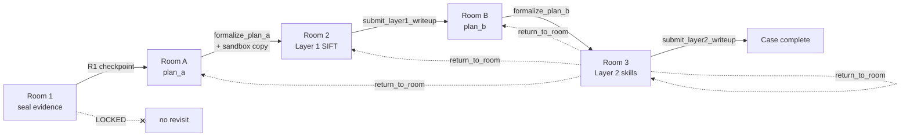

# Cold-box-room hallway design (implemented)

This document describes the **current** hallway as built in `cold-box-room`. It replaces the older `design.md` numbering (where “Room 3” meant planning). In code and prompts today:

| Label | Role |
|-------|------|
| **Room 1** | R1 staging — seal raw evidence |
| **Room A** | Extraction **planning** |
| **Room 2** | Layer 1 **extraction execution** (SIFT) |
| **Room B** | Analysis **planning** |
| **Room 3** | Layer 2 **analysis execution** (skills) |

Forward promotion is harness-gated. The agent cannot skip rooms. Backward travel is allowed to fix mistakes — but **never into Room 1**.

---

## Hallway flow



**Sandbox rule:** R1 evidence is copied into the R2 sandbox **only after** Room A formalizes `plan_a.py` — not on R1 pass alone.

**Revisit rule:** `return_to_room` may target **A, 2, B, or 3** (whichever was already reached forward). **Room 1 is locked** — sealed staging must not be re-opened by the agent (tampering risk).

---

## Agent vs harness

| Field | Who sets it | Harness wall? |
|-------|-------------|---------------|
| **Self-score** (1–10) | Agent | No — agent states it; harness only checks threshold (> 8) |
| **Plan score** (%) | Harness | Yes — from `plan_a.py` / `plan_b.py` step outcomes |
| **Step status** (passed / fail / not_relevant / held_for_later) | Harness | Yes — via `apply_plan_*_step_status` with proof rules |
| **Tool / skill logs** | Harness only | Yes — agent has no write tools for logbooks |
| **Analyst logs** | Agent | Via `submit_layer1_writeup` / `submit_layer2_writeup` only |
| **Findings, why, corrections** | Agent | Written in analyst logs; corrections required after any `return_to_room` |

### Plan step scoring (Room 2 and Room 3)

| Status | Score delta | Notes |
|--------|-------------|--------|
| **passed** | +1 | Requires harness proof (audit_id / scratch or skill run_id) |
| **fail** | −1 | Requires `proof.note` |
| **not_relevant** | 0 | Removed from scoring pool; requires `proof.note` |
| **held_for_later** | 0 | Blocks submit until resolved to a final status |

**Plan score** = `passed / (passed + fail) × 100` among steps still in the pool (excluding `not_relevant`). Minimum to promote/submit: **≥ 70%**.

---

## Room 1 — R1 staging (seal)

**Purpose:** Accept raw uploads only. No agent session in normal flow — intake + checkpoint run before Room A.

**Layout**

- Staging: `COLD_BOX_R1_STAGING` → `{case_id}/` (E01, AFF, etc.)
- After intake: files **sealed read-only** (chmod; harness enforced)
- Hallway state: `records/{case_id}/hallway.json` → `"room": "1"`

**Checkpoint → Room A**

1. At least one evidence file present  
2. File non-empty  

**Agent:** Does not operate here in the agent loop. **Not revisitable** via `return_to_room`.

---

## Room A — Extraction planning

**Purpose:** Decide **what** to extract and **why**. No sandbox, no SIFT runs, no scratch.

**Artifacts**

| File | Writer |
|------|--------|
| `records/{case_id}/plan_a.md` | Agent (`write_plan_a_md`) |
| `records/{case_id}/plan_a.py` | Harness (`formalize_plan_a`) |

Plan markdown: `## Step N — title` + `**Reason:**` only — **no SIFT tool ids** in the plan.

**Optional:** Browse SIFT catalog (`list_sift_tools`, `describe_sift_tool`). **Not required** — no yes/no catalog attestation gate.

**Checkpoint → Room 2**

1. `plan_a.md` valid (≥1 step)  
2. `formalize_plan_a` succeeds → `plan_a.py` aligned with md  
3. `ready_for_room2` true  

**On promotion:** Harness **materializes R2 sandbox** — copies sealed R1 files into `COLD_BOX_R2_SANDBOX/{case_id}/`.

**Agent tools (Room A only):** planning tools + `list_sift_tools` / `describe_sift_tool` browse + `return_to_room` / `list_unlocked_rooms`.

---

## Room 2 — Layer 1 evidence extraction

**Purpose:** Execute `plan_a.py` against the sandbox using **SIFT tools** through the strict harness.

**Evidence:** `input_relpath` is relative to the R2 sandbox root (copy of R1, not live R1).

**Plan execution**

- Run tools per step; mark with `apply_plan_a_step_status`  
- Extend plan if needed: `extend_plan_a_step`  
- Every step must reach a **final** status before submit  
- Plan score ≥ 70%  

**Layer 1 logbook** (heading: `# Layer 1 — Evidence extraction`)

| File | Writer | Agent edits? |
|------|--------|--------------|
| `layer1_tool_log.md` (+ `tool_log.jsonl`) | Harness on every `run_sift_tool` / `analyze_scratch` | **No** |
| `layer1_analyst_log.md` | Agent via `submit_layer1_writeup` | **Yes** (write-up only) |

**Checkpoint → Room B** (all required on `submit_layer1_writeup`)

1. Every `plan_a.py` step resolved (no pending / held_for_later)  
2. Plan score ≥ 70%  
3. ≥1 successful extraction (`run_sift_tool` or `analyze_scratch`, exit 0, scratch logged)  
4. Analyst log complete (findings + why + self_score)  
5. Self-score **> 8** (9 or 10)  

Max **3** failed submit attempts → `exit_layer1` (case ends in Room 2).

**Agent tools:** SIFT execution, plan_a status, Layer 1 read/submit, sandbox listing, revisit tools.

**Revisit:** After Room B or 3, agent may `return_to_room` → **2** to add extractions if analysis reveals gaps.

---

## Room B — Analysis planning

**Purpose:** Read Layer 1 output; plan **how** to analyze it. No extraction, no skill execution.

**Input context for planning**

- `read_layer1_tool_log` — what was extracted (harness proof)  
- `read_layer1_analyst_log` — agent findings, why, self-score from Room 2  

**Artifacts**

| File | Writer |
|------|--------|
| `records/{case_id}/plan_b.md` | Agent (`write_plan_b_md`) |
| `records/{case_id}/plan_b.py` | Harness (`formalize_plan_b`) |

Plan markdown: steps + reasons only — **no skill ids** in the plan (skill choice is Room 3).

**Optional:** Browse skills (`list_skills`, `describe_skill`) and SIFT catalog for reference. **Not required** — no catalog attestation gate (same as Room A).

**Checkpoint → Room 3**

1. `plan_b.md` valid  
2. `formalize_plan_b` succeeds → `plan_b.py` aligned  
3. `ready_for_room3` true  

**Agent tools:** Layer 1 read-only, planning tools, skills/SIFT browse, revisit tools.

---

## Room 3 — Layer 2 analysis execution

**Purpose:** Execute `plan_b.py` using **skill scripts** (`run_skill`). Each skill’s `scripts/agent.py` routes tool calls through the SIFT harness (`skill_runtime`).

**Input context**

- Layer 1 analyst log + tool log (primary facts from extraction)  
- `plan_b.py` steps from Room B  

**Plan execution**

- `run_skill(skill_id, input_relpath, purpose, why)` per step  
- Mark steps: `apply_plan_b_step_status` (proof via `run_id` or `audit_id` from skill log)  
- Extend if needed: `extend_plan_b_step`  
- Same pass/fail / 70% scoring rules as Room 2  

**Skills catalog (committed)**

- **213** agent-runnable skills (`has_script`, not `partial`) — the full committed catalog  
- **126** reference-only playbooks live in `skills/unused/` locally (gitignored) — browse-only if copied back, not in the committed manifest  

`list_skills` defaults to `agent_catalog_only=true`.

**Layer 2 logbook** (heading: `# Layer 2 — Analysis`)

| File | Writer | Agent edits? |
|------|--------|--------------|
| `layer2_skill_log.md` (+ `.jsonl`) | Harness on each `run_skill` | **No** |
| `layer2_tool_log.md` (+ `.jsonl`) | Harness on nested SIFT/scratch from skill scripts + Room 3 `analyze_scratch` | **No** |
| `layer2_analyst_log.md` | Agent via `submit_layer2_writeup` | **Yes** (write-up only) |

Nested tool runs from skill scripts go to **Layer 2** tool log (not Layer 1). Direct SIFT in Room 2 still goes to Layer 1 tool log.

**Checkpoint → case complete** (all required on `submit_layer2_writeup`)

1. Every `plan_b.py` step resolved  
2. Plan score ≥ 70%  
3. ≥1 successful skill run (ok + harness audit ids in skill log)  
4. Analyst log complete (findings + why + self_score + **corrections**)  
5. Self-score **> 8**  
6. If any `return_to_room` occurred: **corrections** must explain the mistake and fix (not `none`)  

Max **3** failed submit attempts → `exit_layer2` (case ends incomplete in Room 3).

**Agent tools:** skill run/browse, plan_b status, Layer 1 + Layer 2 log read, submit/exit, sandbox/scratch, revisit tools.

---

## Backward travel (`return_to_room`)

| Target | Allowed? | Why |
|--------|----------|-----|
| **Room 1** | **No** | Sealed R1 staging — agent must not touch raw table |
| **Room A** | Yes (if reached) | Revise extraction plan |
| **Room 2** | Yes (if reached) | Add/fix extractions |
| **Room B** | Yes (if reached) | Revise analysis plan |
| **Room 3** | Yes (if reached) | Resume analysis after fixing upstream |

Each revisit requires a **reason** (stored in `hallway.json` → `room_revisits`). After a revisit, Room 3 submit must document what was wrong in **corrections**.

Tools: `return_to_room`, `list_unlocked_rooms` (available in all agent rooms).

---

## Case record layout (per case)

```
records/{case_id}/
  hallway.json              # current room, promotion timestamps, revisits
  plan_a.md / plan_a.py     # Room A → executed in Room 2
  plan_b.md / plan_b.py     # Room B → executed in Room 3
  tool_log.jsonl            # Layer 1 harness (jsonl backing store)
  layer1_tool_log.md
  layer1_analyst_log.md
  layer1_state.json         # submit attempts, exit
  layer2_skill_log.jsonl
  layer2_skill_log.md
  layer2_tool_log.jsonl
  layer2_tool_log.md
  layer2_analyst_log.md
  layer2_state.json
  audit.jsonl               # unified audit trail
  AGENT_RUN.jsonl           # agent session events (optional)
  r2_sandbox.json           # sandbox materialization record
```

**Environment roots**

| Variable | Default role |
|----------|----------------|
| `COLD_BOX_R1_STAGING` | Sealed evidence table |
| `COLD_BOX_R2_SANDBOX` | Working copy for SIFT + skills |
| `COLD_BOX_ROOM_RECORDS` | Case records above |

---

## Tool surface by room (guard)

| Room | Execution | Planning | Browse |
|------|-----------|----------|--------|
| **1** | — (no agent) | — | — |
| **A** | blocked | `write_plan_a_md`, `formalize_plan_a` | SIFT catalog |
| **2** | `run_sift_tool`, `analyze_scratch`, plan_a steps, `submit_layer1_writeup` | blocked | SIFT catalog |
| **B** | blocked | `write_plan_b_md`, `formalize_plan_b` | SIFT + skills catalog |
| **3** | `run_skill`, plan_b steps, `submit_layer2_writeup`, `analyze_scratch` | blocked | skills catalog |

All rooms with an agent: `return_to_room`, `list_unlocked_rooms`.

---

## Agent runners

| CLI / engine | Room | Stop condition |
|--------------|------|----------------|
| `run_room_a_agent` | A | `ready_for_room2` |
| `run_layer1_agent` | 2 | promoted to B (`submit_layer1_writeup`) |
| `run_room_b_agent` | B | `ready_for_room3` |
| `run_room3_agent` | 3 | `submit_layer2_writeup` → complete |

**Full hallway E2E:** `cold-box-room-hallway` (or `python -m cold_box_room.e2e.run_hallway`) runs R1 intake → Room A agent → Room 2 agent → Room B agent → Room 3 agent → **`collect_case_report`** (Layer 1 + Layer 2 findings, paths, checkpoints).

Partial E2E: `cold-box-room-e2e` covers R1 → A → Room 2 only. Use `--skip-*-agent` flags on either command for bootstrap without API spend.

---

## Intentionally not in scope (yet)

- **Room 4** / plan-locked batch execution from old `design.md` — not implemented; Room 3 completion is the current terminal gate  
- **Catalog yes/no attestation** — removed; formalize plan is the only planning gate  
- **Reference / partial skills on GitHub** — excluded from runnable catalog; full 339 playbooks optional locally under `skills/unused/`  
- **Room 1 revisit** — permanently locked  

---

## Summary one-liner

**Seal in R1 → plan extraction in A → SIFT extract in 2 → plan analysis in B → run skills in 3 → submit Layer 2 write-up; fix mistakes by going back to A/2/B (never R1), with corrections on the record.**
